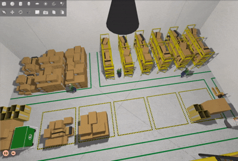

# Warehouse Simulation with Gazebo Fortress

This repository provides an industrial warehouse simulation using Gazebo Fortress on Ubuntu 22.04, built to integrate and communicate with ROS 2 Humble. It is fully containerized with Docker to ensure quick setup, reproducible environments, and consistent runs across machines. The package includes world configurations, models, and launch scripts so you can start the simulation with a single command.



## Installation

This package has been designed and tested in an x86_64 machine under Ubuntu 22.04 (Jammy Jellyfish) operating system and ROS2 Humble distribution.

### Dependencies

To launch the simulator, you need to install:

1.  **Docker:** Essential for building and running the container image.
    *   For installation Docker Desktop instructions, see the official documentation: https://docs.docker.com/desktop/setup/install/linux/ubuntu/.

2.  **NVIDIA Container Toolkit (Optional):** Required only if you want to run the simulation with hardware acceleration (NVIDIA GPU).
    *   For installation, follow the instructions in the [NVIDIA documentation]: https://docs.nvidia.com/datacenter/cloud-native/container-toolkit/latest/install-guide.html.

### Building

Clone the repository to your local machine:

```bash
git clone https://github.com/roboticsuantof/warehouse-simulation.git
cd warehouse-simulation
```
Build the Docker imag

```bash
docker build -t ignition-fortress-app:latest .
```

## Usage

The project includes two scripts to run the simulation, depending on whether you want to use the CPU or an NVIDIA GPU for rendering.

### Running with CPU

This mode uses software rendering and does not require an NVIDIA GPU.

```bash
    xhost +local:root

    docker run -it --rm \
    --net=host \
    --env DISPLAY \
    --volume /tmp/.X11-unix:/tmp/.X11-unix:rw \
    --volume $HOME/.Xauthority:/home/simuser/.Xauthority:ro \
    --device /dev/dri \
    --group-add video \
    ignition-fortress-app:latest
```

### Running with GPU Acceleration (NVIDIA)

This mode leverages an NVIDIA GPU for rendering, which generally results in better performance.


2.  **Run the simulation:**
    Then, use the following command to start the container with GPU support.

    ```bash
        docker run -it --rm \
    --net=host \
    --env DISPLAY \
    --env NVIDIA_VISIBLE_DEVICES=all \
    --env NVIDIA_DRIVER_CAPABILITIES=all \
    --volume /tmp/.X11-unix:/tmp/.X11-unix:rw \
    --volume $HOME/.Xauthority:/home/simuser/.Xauthority:ro \
    --device /dev/dri \
    --group-add video \
    --gpus all \
    ignition-fortress-app:latest
    ```

When you run either of the scripts, the Gazebo Fortress simulation window should appear after a moment, loading the warehouse world.

The first time the simulation is started, it takes a while, but the rest of the executions will take less time due to caching.

### Delete Docker image

First, check your Docker images using:

```
docker image ls
```
Identify the name(REPOSITORY) and the tag(TAG), then use the next command:

```
docker rmi nombre:tag
```
